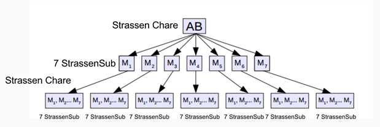
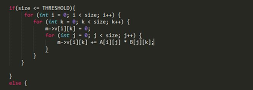
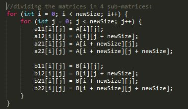
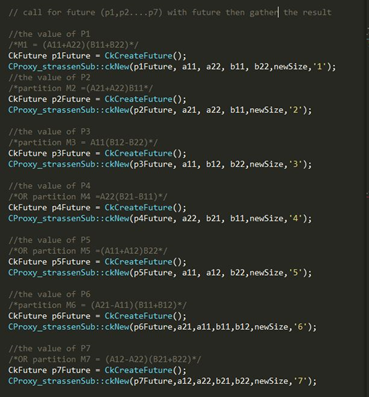
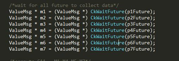
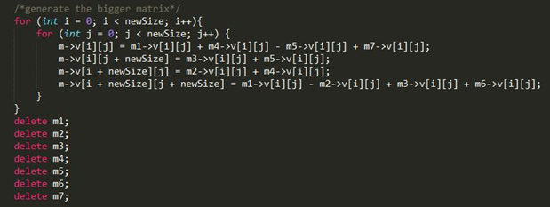
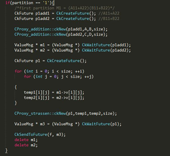
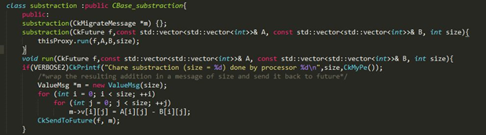
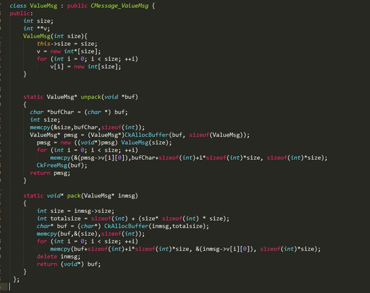

Parallel Programming of Strassen Algorithm for Matrix Multiplication using Charm++

EGR 4303 – Applied Research – Fall 2016 - Al Akhawayn University

Student: Ali ELABRIDI – [a.elabridi@aui.ma](mailto:a.elabridi@aui.ma) - alielabridi@gmail.com

Supervisor: Dr. Naeem Nisar Sheikh 

**_Procedure/ Methodology Installation/Environment_**

The parallelization of Strassen algorithm and its performance analysis needs high performance computing power. I used the Knuth machine of Harvey Mudd College (64 cores, 500GB of RAM).

Running and Testing

To Run the program execute the following command

➢ ./charmrun ./strassen (size) (threshold) (verbosity) +p(# of procs)

The output line:

Charm++ - Correct: matrix size = 1024, Threshold = 32,# of proc = 2 , Exec time = 11.5419

**_Design Structure of Strassen Algorithm using Charm++_**

• Strassen Chare fires the StrassenSub to compute the 7 M partitions

• StrassenSub Chare fires Additition Chare and Substraction Chare in each partition in parrallel

• StrassenSub fires a smaller in size Strassen Chare to perform Multiplication on the result of Addition/Substraction

**_Implementation_**

• **Main Class **https://github.com/alielabridi/Strassen-Algorithm-parallelization-charm- /blob/master/strassen.C

1. Generates a matrix of 1’s and an identitiy matrix 2. Provides Strassen future with the two matrices 3. Records the waiting time for the Strassen future Matrix computation 4. Test the resulting matrix return (check if it is a matrix of 1’s)

**• Strassen Chare Class**

https://github.com/alielabridi/Strassen-Algorithm-parallelization-charm- /blob/master/strassen.C

**1. **Check if size below a certain threshold to run it naively otherwise using Strassen

**2.** If not naively, Partition the two A and B matrices into 4 partitions each

(A11,A12,...B11,...B22)

**3. **Fires the 7 sub-matrices with strassenSub future

**4.** Wait for the different futures of the 7 sub matrices

**5.** Use the 7 sub matrices (n/2) to form the size (n) matrix

**6.** Send the result back to the future using a message of size n

• **StrassenSub Chare Class** https://github.com/alielabridi/Strassen-Algorithm-parallelization-charm- /blob/master/StrassenSub.h

Depending on which of the 7 sub matrices, it will run the appropriate formula by calling addition or subtraction chares, and wrap the result in a message and send it back to the future

• **Addition/Subtraction Chare class **https://github.com/alielabridi/Strassen-Algorithm-parallelization-charm- /blob/master/AddSubMat.h Perform the addition or subtraction of two matrices, and wrap the result in a message of size n and send it back to the future

• **Message Class** https://github.com/alielabridi/Strassen-Algorithm-parallelization-charm- /blob/master/ValueMsg.h The message is dynamically allocated at run time. It also contains the definition of the static methods: packing & unpacking. The purpose of packing and unpacking is to be able to move the message across multiple processors by marshalling it and reconstructing it in another memory space.

